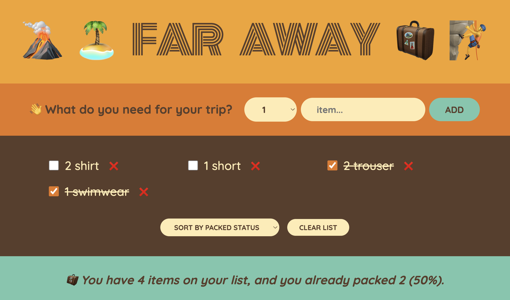

# ⚛️ Far Away — Travel Packing List App

Far Away is a simple and handy web app designed for travelers. It helps you organize your packing by allowing you to:

- ➕ **Add items** you want to bring on your trip.
- ✔️ **Check off items** as you pack them, so you never forget anything.
- 🔀 **Sort your packing list** by item name, description, or whether it’s packed.
- 🗑️ **Clear the entire list** once you're done packing all your items.

Built with React using functional components and the `useState` hook, Far Away offers a smooth and intuitive experience for managing your travel essentials.

Pack smarter, travel farther!

---

## 📸 Screenshot



## 🛠️ Tech Stack


---

## ✨ Features

- ✅ Built with Create React App
- 🎯 Controlled inputs with `useState`
- 💅 Plain CSS for styling
- 🧩 No routing or external libraries

---

## 🚀 Getting Started

```bash
# Install dependencies
npm install

# Run the app locally
npm start
